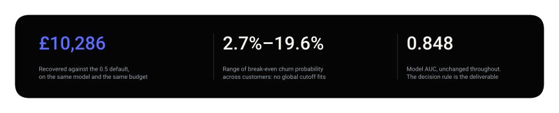
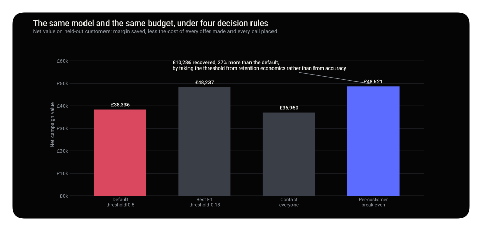
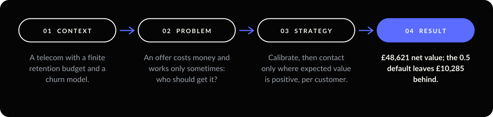
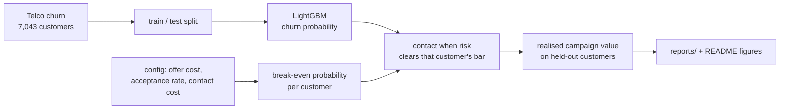
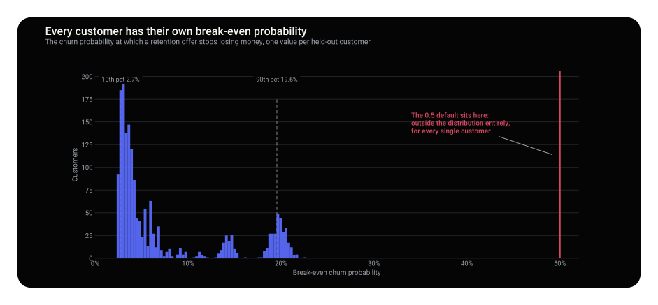
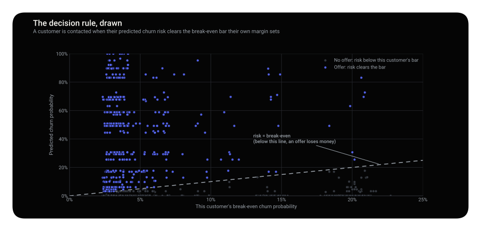

<p align="center"></p>

<p align="center">
  
  
  
  
</p>

**The default 0.5 threshold leaves £10,285 on the table, 21% of the value the campaign could earn.**
The break-even churn probability ranges from 2.7% to 19.6% across customers, so no single global
cutoff can express it.

<p align="center"></p>

<p align="center"></p>

> **Decision.** Replace the 0.5 threshold with the per-customer expected-value rule. Same model, same budget, £10,286 more value.

<details>
<summary><b>What is in this repository</b></summary>

| | |
| --- | --- |
| **The question** | Who gets a retention offer that costs money and works only sometimes? |
| **The data** | Telco churn, 7,043 customers. The retention economics — offer cost, acceptance rate, contact cost — are declared assumptions, isolated in one file. |
| **The method** | LightGBM for the probability, and a decision rule derived from each customer's own margin at risk. |
| **The finding** | The model is not the deliverable. The threshold is, and no single global threshold can express it. |

```
src/churn/  data, the economics, the decision rule, the pipeline, figures
reports/    per-customer decisions and realised campaign value
tests/      the break-even algebra and the campaign-value accounting
```

</details>

<p align="center"></p>

---

## 01 — Context

A telecom can predict who is likely to leave. It wants to spend a retention budget well. An offer
costs money, it only works some of the time, and a saved customer is worth their remaining **margin**,
not their monthly bill.

### Data

| | |
| --- | --- |
| Source | Telco Customer Churn, IBM ([repository](https://github.com/IBM/telco-customer-churn-on-icp4d)) |
| Size | 7,043 customers · 19 features · churn rate 26.5% |
| Split | 5,282 train · 1,761 test, stratified |

**All customer data is real.** The retention economics are **declared assumptions**, which the
dataset does not publish.

`TotalCharges` is blank for 11 customers, and all of them have `tenure = 0`: they have not been
billed yet. The fill is **0**, not the mean. The mean would invent months of billing history and make
`tenure` contradict `TotalCharges`, a contradiction a tree model will happily exploit.

---

## 02 — Problem

The question is not *who will churn*. It is *for whom does a retention offer pay for itself*.

---

## 03 — Strategy

Solve *expected value of contacting = 0* for the churn probability:

```
value_at_risk       = monthly_charges * gross_margin * expected_remaining_months
E[value of contact] = P(churn) * acceptance * value_at_risk
                    - offer_cost * P(churn) * acceptance
                    - contact_cost
break-even P(churn) = contact_cost / (acceptance * (value_at_risk - offer_cost))
```

| Decision | Why |
| --- | --- |
| **Threshold per customer** | `value_at_risk` sits in the denominator, and it varies 7x across customers. A global cutoff averages that away. |
| **Offer cost weighted by acceptance** | The offer is paid only when it is taken; the contact is paid regardless. Getting either wrong fails in opposite directions. |
| **Isotonic calibration** | The probability is multiplied by money. AUC is blind to monotone distortions that move the break-even point. |
| **Stratified random split** | The dataset has no date column. This is a limitation, listed below, not a choice. |

| Assumption ([`config.py`](src/churn/config.py)) | Value | Why it matters |
| --- | --- | --- |
| Offer cost | £45 | Only charged when accepted. |
| Contact cost | £6 | Charged on everyone contacted. |
| Acceptance rate | 35% | The most optimistic number in any retention case, and the least often stated. |
| Gross margin | 55% | Revenue is not margin. |
| Remaining horizon | 12 months | Beyond this, the saving is speculative. |

A customer worth less than the offer has an **infinite** break-even threshold. There is a test for it.



---

## 04 — Result


| Percentile | Break-even P(churn) |
| --- | --- |
| 10th | 2.7% |
| Median | 4.1% |
| 90th | 19.6% |

Same model, same 1,761 test customers. Only the decision rule changes:

| Rule | Contacted | Saved | Net value | vs best |
| --- | --- | --- | --- | --- |
| Threshold at 0.5 (the default) | 450 | 92 | £38,336 | **−21%** |
| Threshold at best F1 (0.18) | 701 | 123 | £48,237 | −0.8% |
| **Per-customer expected value** | 975 | 135 | **£48,621** | — |
| Contact everyone | 1,761 | 146 | £36,950 | −24% |

Contacting everyone saves the most customers and destroys the most value: the offer cost lands on
1,761 people to retain 146.

**An honest caveat.** The expected-value rule beats a tuned F1 threshold by only £384 (0.8%) here.
The result worth defending is the comparison against **0.5**. The gap to a tuned cutoff widens as
customer values spread out or the offer gets more expensive.

> **Decision.** Replace `predict()`'s 0.5 with the per-customer expected-value rule, and contact 975
> customers instead of 450.

---

<p align="center"></p>

<p align="center"></p>

---

## 05 — Limits and next move

- **The acceptance rate is assumed, and it drives everything.** Only a held-out control group can
  measure it.
- **This predicts churn, not persuadability.** The quantity that matters is uplift, and that needs an
  experiment. See [ab-testing-toolkit](https://github.com/arielabade/ab-testing-toolkit).
- **A snapshot, not a time series.** A production churn model must be validated on a later period.
- **Realised value uses a simulated acceptance draw** with a fixed seed. All four rules face the same
  draw, so the comparison is fair; the absolute figure is not a forecast.
- **Next move:** make the offer size a decision variable, spending more on high-value customers and
  less on marginal ones.

---

## Run it

```bash
git clone https://github.com/arielabade/churn-cost-sensitive
cd churn-cost-sensitive
python -m venv .venv && source .venv/bin/activate
pip install -e ".[dev]"

python -m churn.pipeline   # downloads the data, trains, compares the four rules
pytest                     # 10 tests
```

Change any number in `src/churn/config.py` and re-run: thresholds, contact list and recommendation
all move with it.

## Repository map

```
src/churn/   config (the economics), data, economics (the decision rule), pipeline
tests/       the decision rule and the cleaning decisions
reports/     metrics.json, per-customer decisions
notebooks/   threshold exploration
```

---

<p align="center"></p>

<p align="center">
  <a href="https://github.com/arielabade/clv-cohort-prediction">← Rank customers by future value</a> &nbsp;·&nbsp;
  <a href="https://github.com/arielabade">Portfolio</a>
</p>
